## GIt configuration commands

## commmand name: git config --global user.name
**syntax:**
git config --global user.name "username"
## purpose:sets the global username for git commits on your system.
**screenshot:**
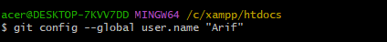

## commmand name: git config --global user.email
**syntax:**
git config --global user.name "e-mail"
## purpose: Sets your global Git email,which will be shown in commit author info.
**screenshot:**
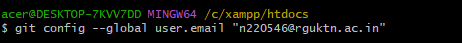

## commmand name: git config --list
**syntax:**
git config --global user.name "username"
## purpose:Displays current Git configuration values including global, local and sysytem
**screenshot:**
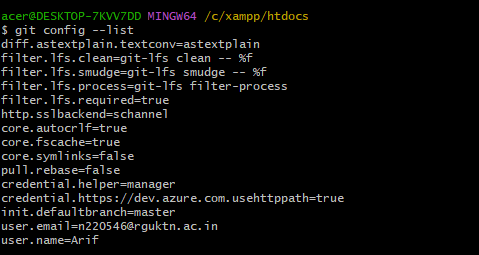

## commmand name: git config --unset
**syntax:**
git config --global user.name "username"
## purpose:Removes a configuration value, useful if you set wrong details.
**screenshot:**
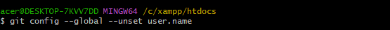

## 2 Repository setup commands

## commmand name: git init
**syntax:**
git init
## purpose:Initializes a new Git repository in the current directory by creating a .git folder to track project history.
**screenshot:**
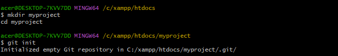

## commmand name: git clone
**syntax:**
git clone repository-url
## purpose:Creates a local copy of an existing remote repository along with its complete commit history.
**screenshot:**

## commmand name: git clone --branch
**syntax:**
git clone --branch branch-name repository-url
## purpose:Clones only a specific branch from the remote repository instead of the default branch.
**screenshot:**
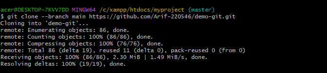

## commmand name: git clone --depth
**syntax:**
git clone --depth number repository-url
## purpose:Performs a shallow clone by downloading limited commit history to make cloning faster and lighter.
**screenshot:**
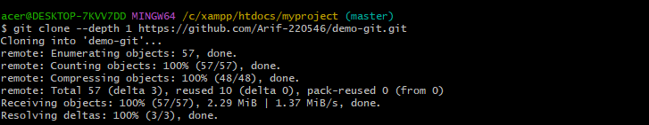

## 3 repository status and information commands

## commmand name: git status
**syntax:**
git status
## purpose:Shows the current state of the working directory including modified, staged and untracked files.
**screenshot:**
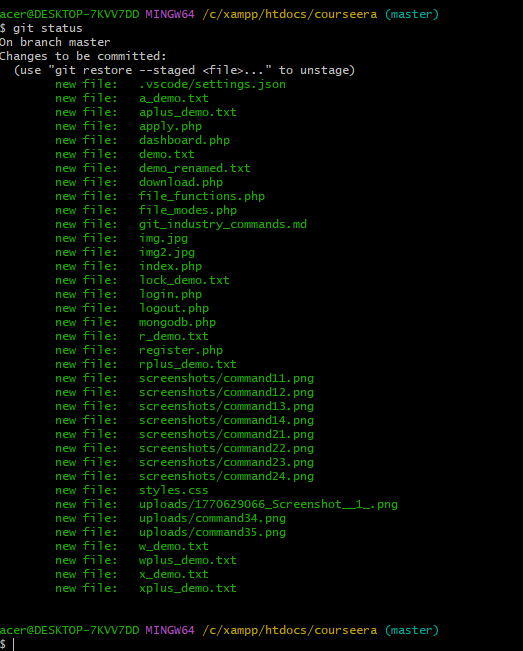

commmand name: git log
syntax:
git log
purpose:Displays complete commit history including commit id, author, date and message.
screenshot:
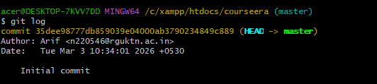

commmand name: git log --oneline
syntax:
git log --oneline
purpose:Shows commit history in a short single-line format for quick viewing.
screenshot:
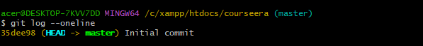

commmand name: git log --graph
syntax:
git log --graph
purpose:Displays commit history in graphical tree format showing branch structure and merges.
screenshot:
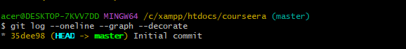

commmand name: git show
syntax:
git show commit-id
purpose:Displays detailed information about a specific commit including changes made.
screenshot:
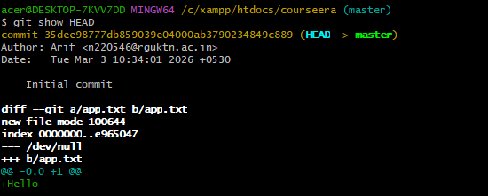

commmand name: git diff
syntax:
git diff
purpose:Shows differences between modified files and the last committed version.
screenshot:
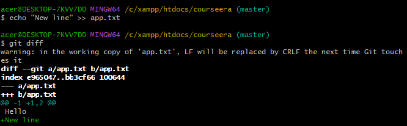

commmand name: git diff --staged
syntax:
git diff --staged
purpose:Displays differences between staged files and the last commit before committing.
screenshot:
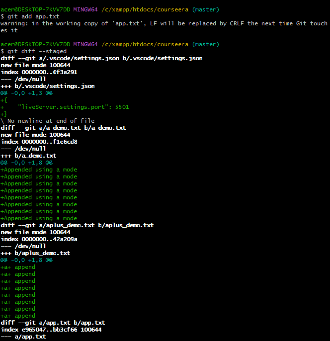

commmand name: git blame
syntax:
git blame filename
purpose:Shows who last modified each line of a file along with commit details.
screenshot:
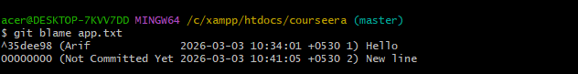

commmand name: git reflog
syntax:
git reflog
purpose:Displays history of all HEAD movements including commits, checkouts and resets.
screenshot:
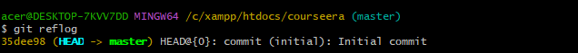

commmand name: git shortlog
syntax:
git shortlog
purpose:Summarizes commit history grouped by author showing contribution count.
screenshot:
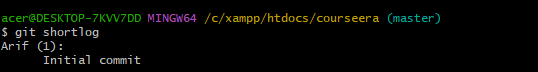

## 4 File tracking commands

commmand name: git add
syntax:
git add filename
purpose:Adds a specific file from working directory to staging area before committing.
screenshot:
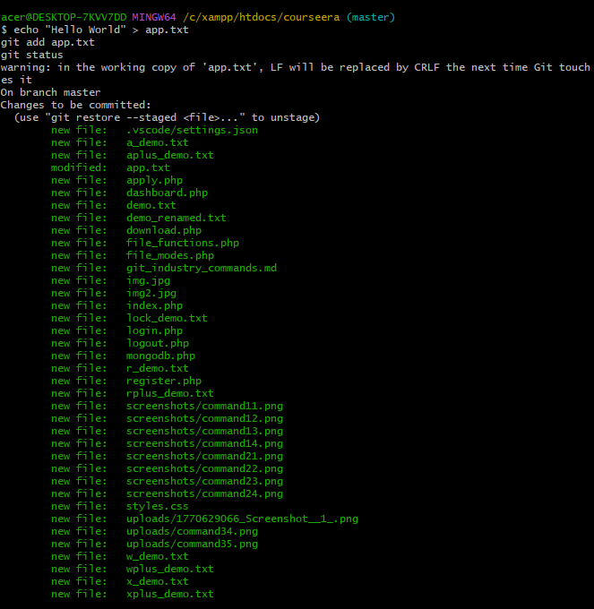

commmand name: git add .
syntax:
git add .
purpose:Adds all modified and new files in the current directory to the staging area.
screenshot:
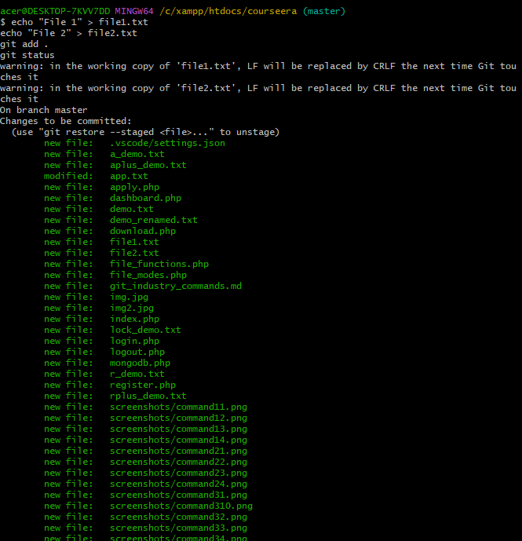

commmand name: git add -p
syntax:
git add -p
purpose:Allows staging changes interactively by selecting parts of modifications instead of the entire file.
screenshot:
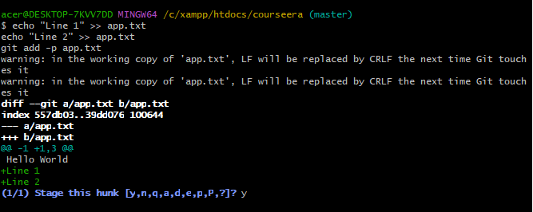

commmand name: git restore
syntax:
git restore filename
purpose:Discards changes in the working directory and restores file to last committed version.
screenshot:
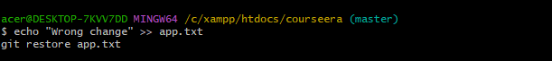

commmand name: git restore --staged
syntax:
git restore --staged filename
purpose:Removes a file from staging area without deleting changes in working directory.
screenshot:
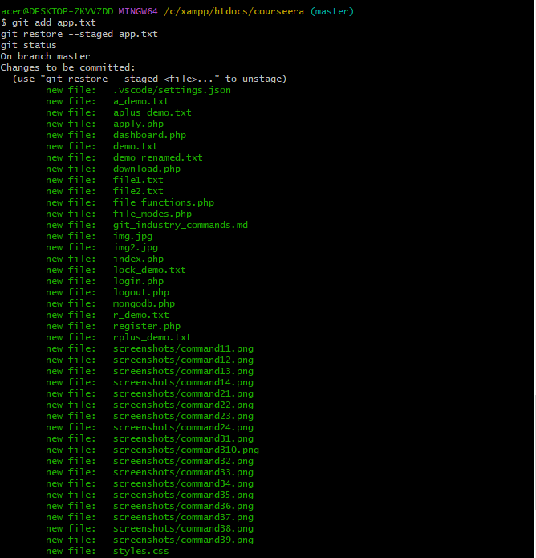

commmand name: git rm
syntax:
git rm filename
purpose:Removes a file from both working directory and Git tracking system.
screenshot:
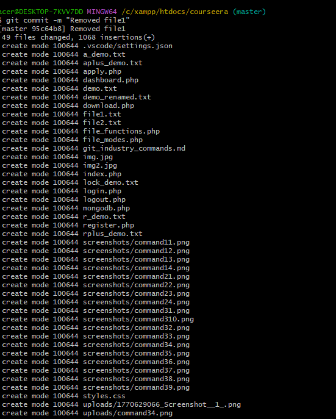

commmand name: git mv
syntax:
git mv oldfilename newfilename
purpose:Renames or moves a file while keeping Git history intact.
screenshot:
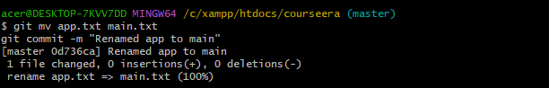

## 5 Commit Commands

commmand name: git commit
syntax:
git commit
purpose:Creates a new commit with the staged changes.
Opens the default text editor to write a commit message.
screenshot:
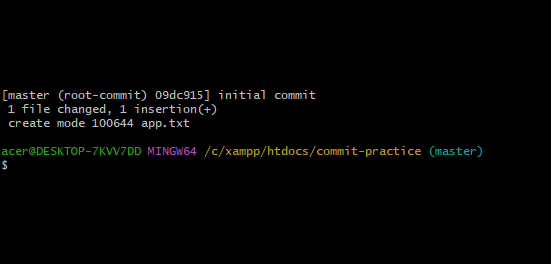

commmand name: git commit -m
syntax:
git commit -m "commit message"
purpose:Creates a commit with a message directly from the command line (without opening editor).
This is the most commonly used commit command in industry.
screenshot:
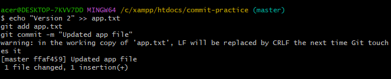

commmand name: git commit --amend
syntax:
git commit --amend
purpose:Modifies the most recent commit.
Add missed fil
correct small mistakes
screenshot:
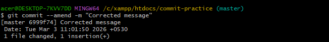

commmand name: git commit --no-edit
syntax:
git commit --amend --no-edit
purpose:Amends the previous commit without changing the existing commit message.
Useful when you forgot to add a file but message is correct.
screenshot:
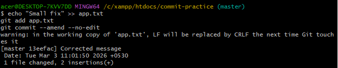

## 6 branch moment commands

command name:git branch
syntax:
git branch
purpose:Lists all the local branches in the current repository and highlights the current active branch with 
screenshot:

command name:git branch -a
syntax:
git branch -a
purpose:Displays all branches, including local and remote branches available in the repository.
screenshot:
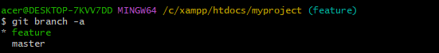

command name:git branch -d
syntax:
git branch -d branch-name
purpose:Deletes a local branch safely.
Git only deletes the branch if it has already been merged into the current branch.
screenshot:
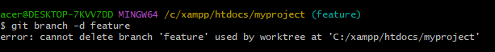

command name:git branch -D
syntax:
git branch -D branch-name
purpose:Force deletes a branch even if it has not been merged.
Used when you want to remove a branch without checking merge status.
screenshot:
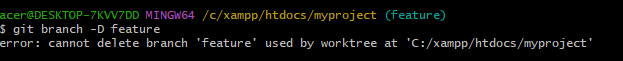

command name:git checkout
syntax:
git checkout branch-name
purpose:Switches from the current branch to another existing branch.
screenshot:
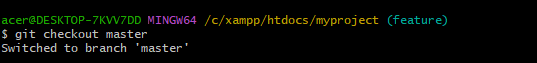

command name:git checkout -b
syntax:
git checkout -b branch-name
purpose:
Creates a new branch and immediately switches to it.
screenshot:
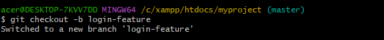

command name:git switch
syntax:
git switch branch-name
purpose:
Switches between branches.
This is a newer and simpler alternative to git checkout for branch switching.
screenshot:
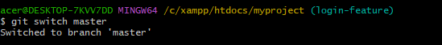

command name:git switch -c
syntax:
git switch -c branch-name
purpose:Creates a new branch and switches to it.
It is the modern replacement for git checkout -b.
screenshot:
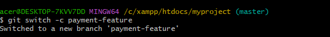

## 7 merge nad integration commands

command name:git merge
syntax:
git merge branch-name
purpose:Combines changes from the specified branch into the current branch, integrating the commit histories of both branches.
screenshot:
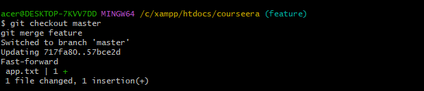

command name: git merge --no-ff
syntax:
git merge --no-ff branch-name
purpose:Performs a merge while forcing a merge commit, even when a fast-forward merge is possible, preserving the branch history.
screenshot:

## 8 Remote Repository Commands

command name:git remote
syntax:
git remote
purpose:Displays the list of remote repositories connected to the local repository.
screenshot:
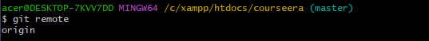

command name:git remote -v
syntax:
git remote -v
purpose:Shows the remote repository URLs associated with fetch and push operations.
screenshot:
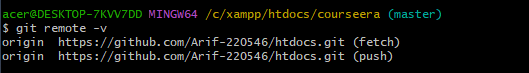

command name:git remote add
syntax:
git remote add remote-name repository-url
purpose:Adds a new remote repository connection to the current Git project.
screenshot:
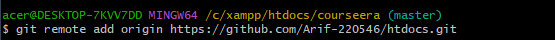

command name:git remote remove
syntax:
git remote remove remote-name
purpose:Removes a remote repository reference from the local repository configuration.
screenshot:
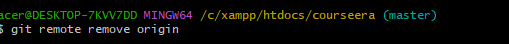

command name:git fetch
syntax:
git fetch
purpose:Downloads new commits, branches, and tags from the remote repository without merging them into the current branch.
screenshot:
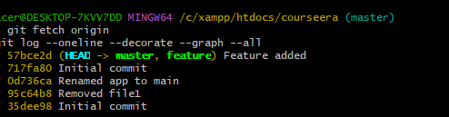

command name:git fetch --all
syntax:
git fetch --all
purpose:Fetches updates from all remote repositories configured in the current project.
screenshot:

command name:git pull
syntax:
git pull
purpose:Fetches changes from the remote repository and automatically merges them into the current branch.
screenshot:
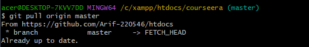

command name:git pull --rebase
syntax:
git pull --rebase
purpose:Fetches updates from the remote repository and rebases the local commits on top of the updated remote branch.
screenshot:
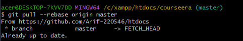

command name:git push
syntax:
git push
purpose:Uploads local commits to the connected remote repository.
screenshot:
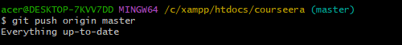

command name:git push -u origin branch-name
syntax:
git push -u origin branch-name
purpose:Pushes the specified branch to the remote repository and sets it as the upstream branch for future push and pull commands.
screenshot:
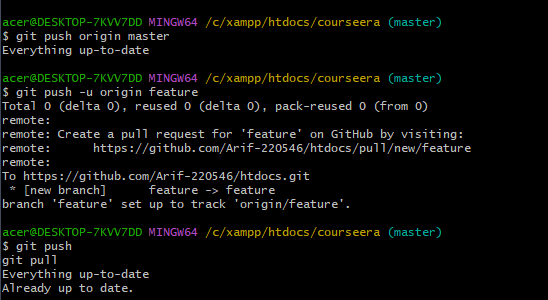

command name:git push --force
syntax:
git push --force
purpose:Forces the push operation by overwriting the remote branch history with the local branch history.
screenshot:
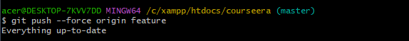

## 9 stash commands

command name:git stash
syntax:
git stash
purpose:Temporarily saves uncommitted changes and cleans the working directory so you can switch branches or perform other operations.
screenshot:
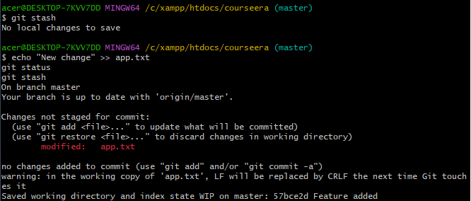

command name:git stash list
syntax:
git stash list
purpose:Displays all saved stash entries stored in the repository.
screenshot:
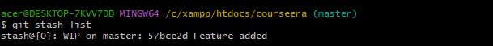

command name:git stash pop
syntax:
git stash pop
purpose:Applies the most recent stash and removes it from the stash list.
screenshot:
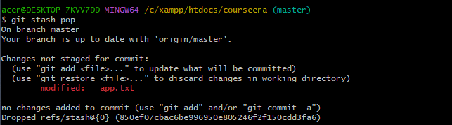

command name:git stash apply
syntax:
git stash apply
purpose:Applies the most recent stash without removing it from the stash list.
screenshot:
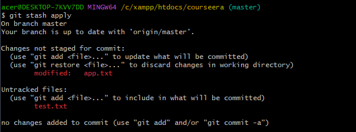

command name:git stash drop
syntax:
git stash drop
purpose:Deletes a specific stash entry from the stash list.
screenshot:

command name:git stash clear
syntax:
git stash clear
purpose:Removes all stash entries from the repository permanently.
screenshot:

## 10 Reset & Undo Commands

command name:git reset
syntax:
git reset commit-id
purpose:Moves the current branch pointer to the specified commit and resets the staging area accordingly, allowing changes to be modified or recommitted.
screenshot:

command name:git reset --soft
syntax:
git reset --soft commit-id
purpose:Resets the branch to a specified commit while keeping all changes staged in the index.
screenshot:

command name:git reset --mixed
syntax:
git reset --mixed commit-id
purpose:Resets the branch to the specified commit and unstages changes, but keeps them in the working directory. This is the default mode of git reset.
screenshot:

command name:git reset --hard
syntax:
git reset --hard commit-id
purpose:Resets the branch, staging area, and working directory to the specified commit, permanently discarding all changes.
screenshot:

command name:git revert
syntax:
git revert commit-id
purpose:Creates a new commit that reverses the changes made by a previous commit without altering the commit history.
screenshot:

command name:git clean -f
syntax:
git clean -f
purpose:Removes untracked files from the working directory.
screenshot:

command name:git clean -fd
syntax:
git clean -fd
purpose:Removes untracked files and directories from the working directory.
screenshot:

## 11 Rebasing commands

command name:git rebase
syntax:
git rebase branch-name
purpose:Reapplies commits from the current branch onto another base branch, creating a linear commit history without merge commits.
screenshot:

command name:git rebase -i
syntax:
git rebase -i branch-name
purpose:Performs an interactive rebase, allowing you to edit, reorder, squash, or remove commits during the rebase process.
screenshot:

command name:git rebase --continue
syntax:
git rebase --continue
purpose:Continues the rebase process after resolving merge conflicts and staging the resolved files.
screenshot:

command name:git rebase --abort
syntax:
git rebase --abort
purpose:Cancels the ongoing rebase operation and restores the repository to its previous state before the rebase started.
screenshot:

## 12 Cherry Pick  and  Patch Commands

command name:git cherry-pick
syntax:
git cherry-pick commit-id
purpose:Applies a specific commit from one branch to another branch without merging the entire branch.
screenshot:

command name:git format-patch
syntax:
git format-patch number-of-commits
purpose:Creates patch files from commits which can be shared or applied in another repository.
screenshot:

command name:git apply
syntax:
git apply patch-file
purpose:Applies changes from a patch file to the working directory without creating a commit.
screenshot:

command name:git am
syntax:
git am patch-file
purpose:Applies patch files generated with git format-patch and automatically creates commits from them.
screenshot:

## 13 Tagging Commands

command name: git tag
syntax:
git tag
purpose:
Lists all tags available in the repository.
screenshot:

command name:git tag -a
syntax:
git tag -a tag-name -m "message"
purpose:Creates an annotated tag with additional information such as tagger name, date, and message.
screenshot:

command name:git tag -d
syntax:
git tag -d tag-name
purpose:Deletes a specific tag from the local repository.
screenshot:

command name:git push origin --tags
syntax:
git push origin --tags
purpose:Pushes all local tags to the remote repository.
screenshot:

## 14 Submodule Commands

command name:git submodule add
syntax:
git submodule add repository-url
purpose:Adds another Git repository as a submodule inside the current repository.
screenshot:

command name:git submodule init
syntax:
git submodule init
purpose:
Initializes the submodule configuration in the local repository.
screenshot:

command name:git submodule update
syntax:
git submodule update
purpose:
Downloads the submodule content and checks out the commit specified in the main repository.
screenshot:

## 15 Debugging Commands

command name:git bisect
syntax:
git bisect
purpose:Starts the process of binary search debugging to identify which commit introduced a bug.
screenshot:

command name:git bisect start
syntax:
git bisect start
purpose:Begins the bisect session to locate the problematic commit.
screenshot:

command name:git bisect good
syntax:
git bisect good
purpose:Marks a commit as working correctly during the bisect process.
screenshot:

command name:git bisect bad
syntax:
git bisect bad
purpose:Marks a commit as containing the bug, helping Git narrow down the problematic commit.
screenshot:

